# PCB YOLO + CNN (Stage1 + Stage2)

This is a 2-stage system for PCB defect detection and classification:
- Stage 1 (YOLO): detects defect bounding boxes (bbox).
- Stage 2 (CNN): classifies the defect type for each bbox.

## Table of Contents

- Pipeline Overview
- Script and Folder Structure
- Dataset
- Installation
- Quick Demo (drop images into folder)
- Full Inference
- End-to-End System Evaluation
- Stage 2 Model Comparison
- Results Visualization
- TensorBoard
- Output Folders

## Pipeline Overview

1) YOLO detects bounding boxes on the PCB image. 
2) Crops the image according to the bounding boxes and feeds them into the CNN. 
3) CNN predicts the defect type and provides a confidence score. 
4) Aggregates the results and saves them as JSON + images with bounding boxes.

## Script and Folder Structure

| File/Folder | Description |
| --- | --- |
| `stage12_yolo_cnn_system.py` | Pipeline for YOLO + CNN inference, saves JSON + annotated images |
| `stage2_cnn_utils.py` | CNN utilities: load checkpoint, preprocess, classify crop |
| `evaluate_stage12_system.py` | End-to-end evaluation (mAP/precision/recall + accuracy + latency) |
| `compare_stage2_models.py` | Compare ResNet18/50/EfficientNet and export table |
| `stage2_train_resnet18.py` | Train CNN ResNet18 (Stage 2) |
| `stage2_train_resnet50.py` | Train CNN ResNet50 (Stage 2) |
| `stage2_train_efficientnet.py` | Train CNN EfficientNet-B2 (Stage 2) |
| `stage2_crop_dataset.py` | Crop from YOLO dataset to CNN dataset |
| `pcb-defect-dataset/` | YOLO dataset (images/labels by split) |
| `pcb-defect-cls/` | CNN dataset (images classified by type) |
| `runs/` | Save train/eval/infer outputs and images |
| `demo_stage12_one_image.py` | Quick demo script (drop image to test) |

## Dataset

- Kaggle: https://www.kaggle.com/datasets/norbertelter/pcb-defect-dataset

## Installation

Install the required libraries:

```powershell
python -m pip install -r .\requirements.txt
```

## Quick Demo (drop images into folder)

1) Place images in the `demo_input/` folder.
2) Run the demo script:

```powershell
python .\demo_stage12_one_image.py
```

Results will be saved in the `demo_output/` folder:
- `*_annotated.jpg`: Images with bounding boxes and annotations.
- `*.json`: JSON files with prediction results.
- `predictions_summary.json`: Summary of predictions.

### Demo with a specific image

To run the demo on a specific image with custom weights:

```powershell
python .\demo_stage12_one_image.py --input D:\path\to\image.jpg --yolo .\runs\detect\v8m_768_adamw_aug\weights\best.pt --cnn .\runs\stage2\resnet18\best.pt
```

## Full Inference

Run inference on a single image or a folder using the main pipeline script:

```powershell
python .\stage12_yolo_cnn_system.py D:\path\to\images --yolo .\runs\detect\v8m_768_adamw_aug\weights\best.pt --cnn .\runs\stage2\resnet18\best.pt --imgsz 768 --conf 0.25 --iou 0.7 --save-dir .\runs\system_infer
```

## End-to-End System Evaluation

Evaluate the system on the `test` split:

```powershell
python .\evaluate_stage12_system.py --data .\pcb-defect-dataset\data.yaml --split test --yolo .\runs\detect\v8m_768_adamw_aug\weights\best.pt --cnn .\runs\stage2\resnet18\best.pt --imgsz 768 --conf 0.25 --iou 0.7 --match-iou 0.5 --save-dir .\runs\system_eval\resnet18_test
```

### End-to-End Results Summary (test split)

Source: `runs/system_eval/*/system_summary.json`

| Stage 2 Model | System Accuracy | Classification Accuracy (on detected) | Macro F1 Score | Latency (ms/img) | Misclassifications | Missed Defects | False Positives |
| --- | --- | --- | --- | --- | --- | --- | --- |
| ResNet18 | 0.7484 | 0.9770 | 0.9777 | 33.05 | 38 | 505 | 36 |
| ResNet50 | 0.7400 | 0.9661 | 0.9662 | 37.54 | 56 | 505 | 36 |
| EfficientNet-B2 | 0.7567 | 0.9879 | 0.9880 | 51.38 | 20 | 505 | 36 |

## Stage 2 Model Comparison

Source: `runs/stage2/model_comparison/stage2_model_comparison.md`

| Model | Validation Accuracy | Validation F1 Score | Test Accuracy | Test F1 Score | Parameters | Inference Time |
| --- | --- | --- | --- | --- | --- | --- |
| ResNet18 | 1.0000 | 1.0000 | 1.0000 | 1.0000 | 11.18M | 2.89 ms/img |
| ResNet50 | 0.9995 | 0.9995 | 0.9991 | 0.9990 | 23.52M | 6.58 ms/img |
| EfficientNet-B2 | 0.9995 | 0.9995 | 0.9981 | 0.9981 | 7.71M | 14.55 ms/img |

## Results Visualization

### Example Demo Output

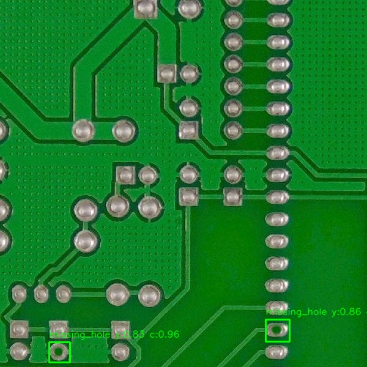

### YOLO Metrics (Stage 1)

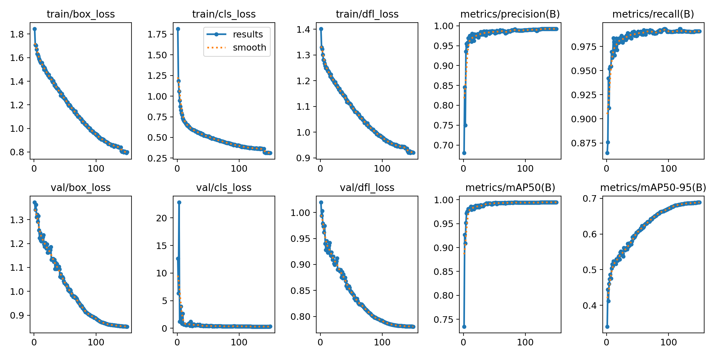
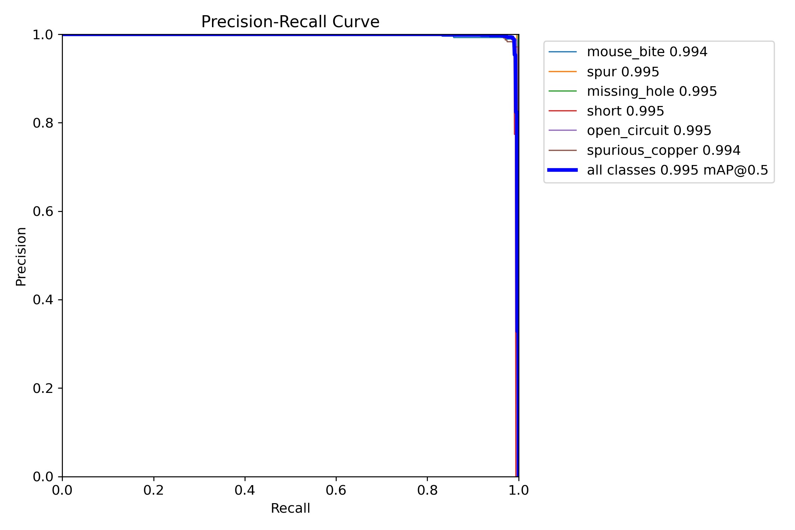
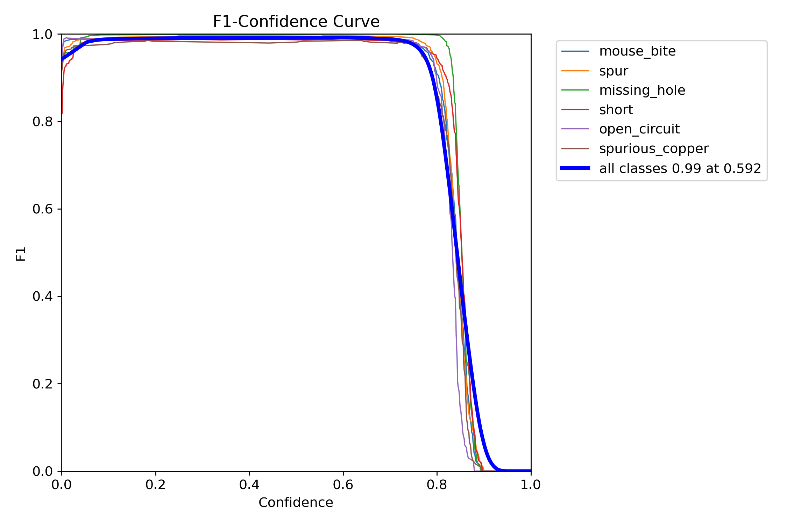
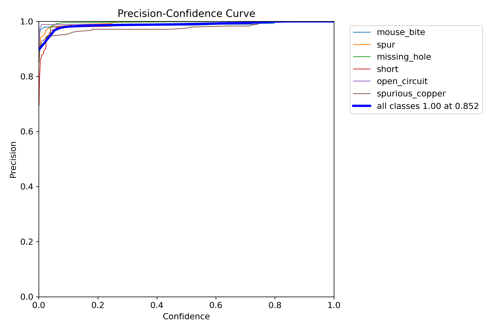
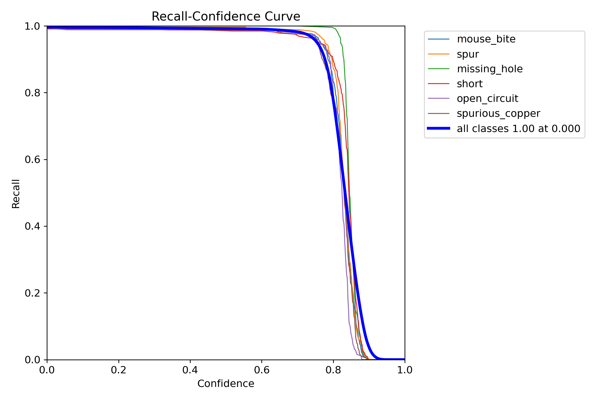
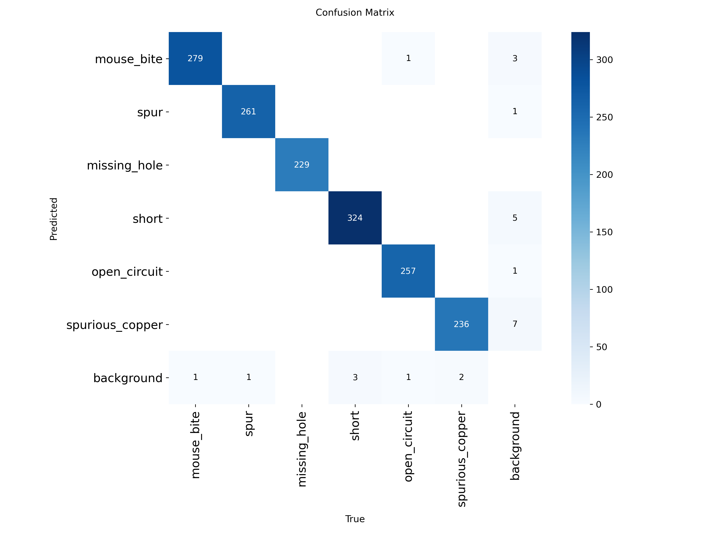
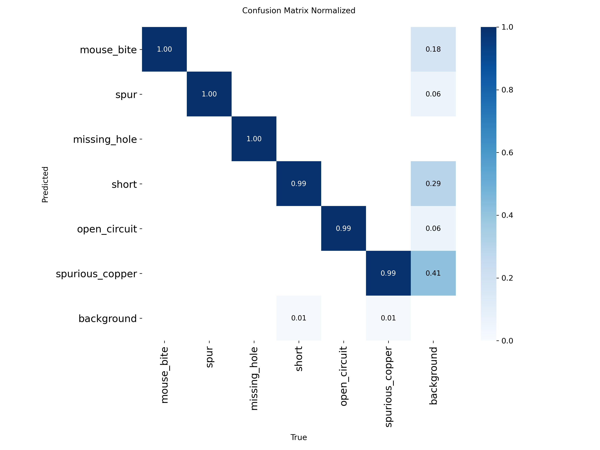

### YOLO Prediction Samples

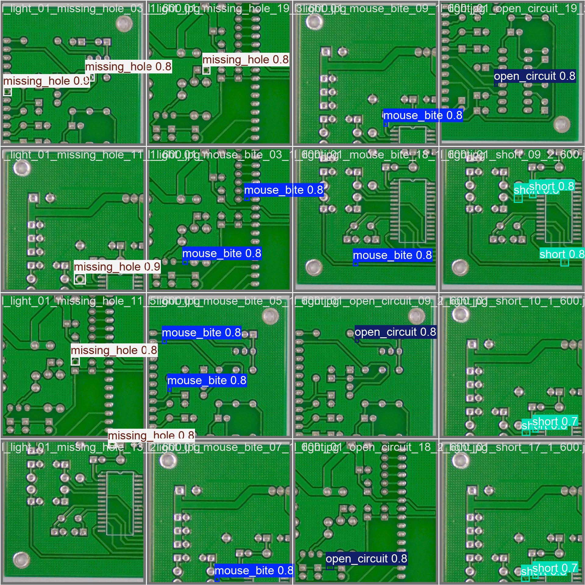
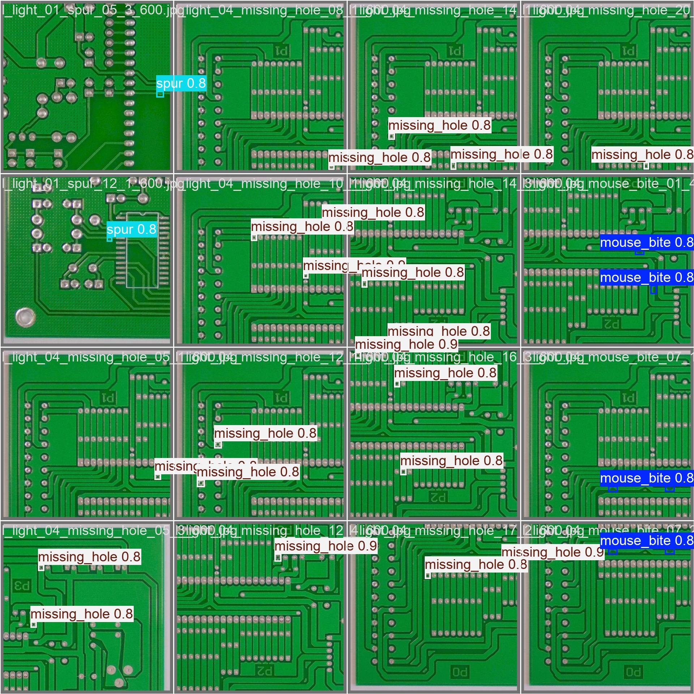
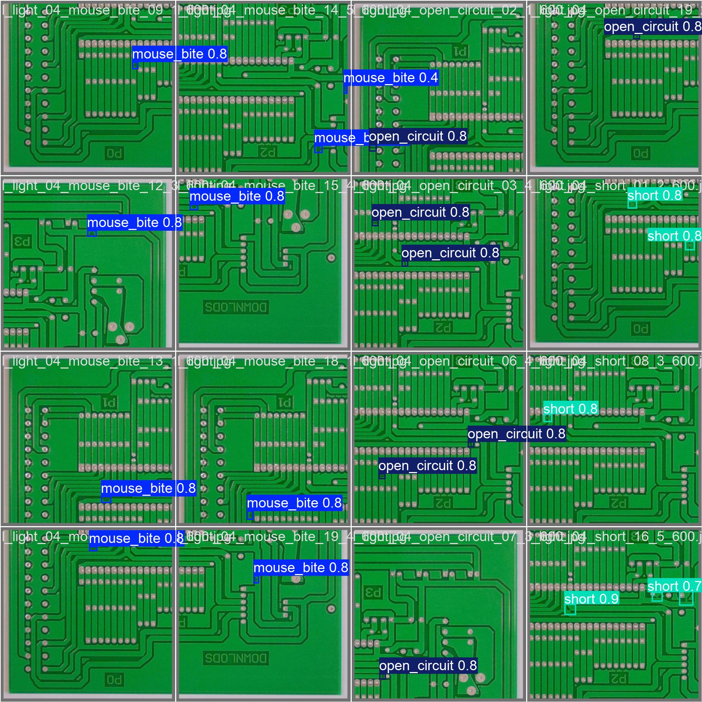

### Stage 2 Metrics (CSV Files)

Stage 2 saves the confusion matrix and report as:
- `runs/stage2/resnet18/test_confusion_matrix.csv`
- `runs/stage2/resnet18/test_classification_report.txt`
- `runs/stage2/resnet50/test_confusion_matrix.csv`
- `runs/stage2/efficientnet_b2/test_confusion_matrix.csv`

To create confusion matrix images, use numpy/pandas + matplotlib to plot from the CSV files.

## TensorBoard

### TensorBoard Screenshot

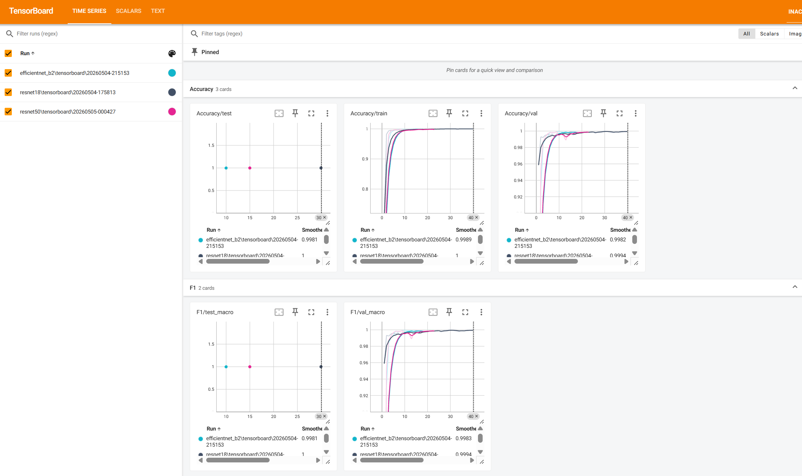

Add your screenshot at `docs/tensorboard_overview.png` (you can use the attached TensorBoard image).

TensorBoard logs for Stage 2 are saved in:
- `runs/stage2/resnet18/tensorboard/`
- `runs/stage2/resnet50/tensorboard/`
- `runs/stage2/efficientnet_b2/tensorboard/`

To run TensorBoard:

```powershell
tensorboard --logdir .\runs\stage2
```

Open a browser and go to `http://localhost:6006` to view scalars and curves.

## Output Folders

| Folder | Content |
| --- | --- |
| `runs/detect/v8m_768_adamw_aug/` | YOLO training output + metric images |
| `runs/system_infer/` | YOLO + CNN inference output |
| `runs/system_eval/*/` | End-to-end evaluation report + CSV errors |
| `runs/stage2/*/` | CNN checkpoints, TensorBoard logs, evaluation reports |
| `demo_output/` | Quick demo output |
